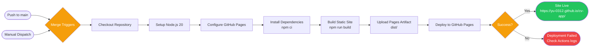

# CV Studio

> 一個整合履歷、學習歷程、求職顧問與學測落點分析的 PWA 工作台。

[English Version](README.en.md)

正式站：<https://yu-0312.github.io/cv-app/>

CV Studio 是一個無框架的單頁 Web App，主打「登入後保存」的履歷與申請資料整理流程。未登入時只顯示提示詞；登入 Google 後可透過 Supabase 將 CV 資料綁定到個人帳號，並在 GitHub Pages 上自動部署。

## 功能亮點

- **CV 履歷編輯器**：28 種履歷模板、即時預覽、版面微調、多版本管理、PDF 預覽與匯出。
- **WYSIWYG 直接編輯**：可在履歷預覽中直接點選欄位修改內容。
- **Google 登入與雲端同步**：使用 Supabase Auth + Google OAuth，搭配 RLS 保護個人資料。
- **未登入提示詞模式**：未登入時不保留個人資料；登出後會清空本機個資資料並回到提示詞。
- **學習歷程 Portfolio**：章節式作品集、圖片、附件與成果摘要整理，支援素材庫與 PDF 匯出。
- **公開分享與 SEO**：公開 CV 分享頁支援動態 SEO / Open Graph metadata 與分享預覽圖。
- **Career 求職顧問 + Career Ops**：自動讀取 CV 履歷頁摘要，支援單筆職缺適配分析、推薦崗位、面試準備、求職信，以及批次職缺匯入、評估、追蹤與客製 ATS PDF；目前不提供 PDF / CV 檔案上傳。
- **學測落點分析**：支援 115 學年度校系資料、University TW 快照與 104 落點資料匯入流程。
- **PWA 支援**：可安裝為桌面或手機 App，並透過 Service Worker 提供離線快取。

## 快速開始

### 需求

- Node.js 20 或以上
- Supabase 專案
- Google Cloud OAuth Client
- GitHub repository（若要使用 GitHub Pages 部署）

### 安裝

```bash
npm install
```

### 設定 Supabase

如果你 fork 或自架這個專案，請先複製設定檔範本，或直接更新既有的 `config.js`：

```bash
cp config.example.js config.js
```

編輯 `config.js`：

```js
window.CV_STUDIO_CONFIG = {
  supabaseUrl: "https://your-project.supabase.co",
  supabaseAnonKey: "your-anon-key",
  siteUrl: "https://your-username.github.io/your-repo/",
  canvaConnectUrl: "https://www.canva.com/",
  defaultTemplate: "n-tech"
};
```

Supabase anon key 是前端可公開使用的 key，但仍需要搭配資料庫 RLS。若要改成自己的專案，請同步更新 Supabase 與 Google OAuth 的允許網址。正式部署時，GitHub Actions 會在沒有 `config.js` 的情況下產生安全 fallback；若要啟用正式登入，請確保部署環境有正確設定檔或在前端設定面板填入 Supabase 資訊。

### 建置

```bash
npm run build
```

輸出會寫入 `dist/`，包含：

- `index.html`
- `404.html`
- `manifest.json`
- `sw.js`
- `config.js`
- `data/app/*`
- `.nojekyll`

### 測試

```bash
npm run smoke:test
```

Smoke test 會先建置 `dist/`，再用 headless Chrome 檢查主要流程：

- Google 登入與登出 UI 狀態
- 登出後清除 session 與本機個資資料，並恢復提示詞
- Career 頁基本互動
- 學測落點分析正向流程與 fallback
- 模板 placeholder 一致性

## 部署到 GitHub Pages

下圖為完整的部署流程（n8n 可匯入版本：[n8n/deploy-workflow.json](n8n/deploy-workflow.json)）：



本專案已內建 `.github/workflows/deploy.yml`。

1. 將 repository 推到 GitHub。
2. 到 **Settings > Pages**。
3. Source 選擇 **GitHub Actions**。
4. 每次 push 到 `main` 都會自動建置並部署 `dist/`。

目前正式站：

```text
https://yu-0312.github.io/cv-app/
```

如果更換 GitHub Pages 網址，請同步更新：

- `config.js` 的 `siteUrl`
- Supabase Authentication 的 Site URL / Redirect URLs
- Google Cloud OAuth 的 Authorized JavaScript origins / redirect URIs

Google OAuth 無法從 `file://` 本機檔案模式正常回跳。請使用 `http://localhost` 或正式 `https://` 網址測試登入。

## 使用方式

### CV 履歷

- 在表單區輸入資料，預覽區會即時更新。
- 可切換模板、調整版面、套用職位推薦模板。
- 支援 JSON 匯入/匯出、多版本 CV、投遞紀錄、復原/重做、QR Code、PDF 預覽與下載。
- 可在「雙語內容欄位對照」中逐欄維護中文與英文內容；履歷標題語言切到 English 時，預覽會優先使用英文欄位。

### 未登入與登入資料

- 未登入：不保留個人 CV、作品集、版本或投遞資料，只顯示提示詞。
- 登入後：可讀取與儲存 Supabase 雲端 CV。
- 登出後：系統會清除 Supabase session 與本機個資資料，並恢復提示詞，避免個資殘留在未登入畫面。

### 學習歷程

Portfolio 分頁可建立章節式作品集，支援封面、章節、小節、圖片與摘要內容，適合整理備審資料或作品紀錄。素材庫可上傳圖片、PDF、文件與壓縮檔；登入後會寫入 `cv-images` Supabase Storage，未登入時不保留素材資料。

### 公開分享頁

登入後可發布公開 CV 分享頁。系統會產生分享用 SEO / Open Graph metadata，並嘗試將 1200×630 的分享預覽圖上傳到 `cv-images` bucket；若 Storage 不可用，會退回預設 `og-image.svg`。

### Career 求職顧問

Career 分頁會讀取 CV 履歷頁已填寫的摘要、技能、經歷、教育與專案資料，再搭配職缺描述產生：

- 職位適配度分析
- 推薦崗位
- STAR 面試故事
- 求職信草稿
- Career Ops 批次職缺追蹤器：可貼上多筆 JD / URL 清單，批次評估、排序、更新投遞狀態、匯出 CSV
- 針對單一職缺產生客製 ATS PDF 與投遞信草稿

此功能採用 `career-ops` 類型的評估思路（A-F / 分數、ATS 關鍵字、STAR 面試故事、投遞優先級排序），並內建輕量批次追蹤器、公司招聘頁職缺探索與客製 PDF 產生流程；尚未包含登入型 portal scanner 或跨平台排程 worker。

API Key 只保留在目前瀏覽器頁籤的 `sessionStorage`。呼叫模型時只會送到使用者選擇的 AI provider，不會寫入 Supabase、Railway、GitHub Actions 或任何站方資料庫。履歷上傳 / 50-100 職缺比對也採 BYOK：前端用使用者自己的 key 解析履歷 profile，接著直接在瀏覽器讀取 `data/app/career-ops-jobs.js` 進行三層 heuristic 比對；登入時才把完成結果寫入 Supabase 供分享，不需要站方 `ANTHROPIC_API_KEY` 或 Railway worker。

#### Career Ops 對應

| Career Ops 能力 | 本專案對應實作 | 邊界 |
|---|---|---|
| 自動化排程 | `.github/workflows/career-ops.yml` 每日產生職缺快照，可手動 dispatch；若存在 `data/career-ops-source-strategy.json` 會先 build sources | 需要在 repo 放置 source strategy 或 `data/career-ops-sources.json` |
| 大量職缺搜集 | `scripts/career-ops-build-sources.mjs` + `scripts/career-ops-worker.mjs` + `scripts/career-ops-source-adapters.mjs`，支援 source strategy、Greenhouse / Lever / Ashby / Workable / SmartRecruiters / BambooHR / Workday / Oracle / SuccessFactors / Taleo adapter、公司 careers 頁探索與單一職缺頁擷取 | 登入型 portal 繼續新增 adapter |
| 職缺正規化與生命週期 | `data/app/career-ops-jobs.json` / `.js` 快照，統一 `title`、`company`、`url`、`location`、`description`、`sourceType`，並標記 `jobKey`、`isNew`、`isExpired`、`firstSeenAt`、`lastSeenAt` | 前端只讀 normalized snapshot |
| 海量篩選與排序 | Career Ops 面板批次匯入、批次 AI 評估、分數 / grade / status 排序與 CSV 匯出；履歷上傳後的 50-100 職缺比對會在前端本機完成；`scripts/career-ops-evaluate.mjs` 可在後端批次 heuristic scoring；`scripts/career-ops-intelligence.mjs` 會做去重訊號、特徵抽取、多維分數、分群與市場洞察 | 前端 AI 評估需要使用者提供 API key；後端 intelligence 可離線跑 |
| 10 維度 Rubric | `data/career-ops-rubric.example.json` 定義 profile match、ATS coverage、role fit、seniority、location、source quality、freshness、compensation、growth、application effort 與風險扣分 | 可複製後依不同使用者或市場調權重 |
| Search adapter | `scripts/career-ops-search-adapter.mjs` 可把匯出的搜尋結果 JSON / HTML / URL list 轉成 worker sources，並保留 search query strategy signals | 不直接抓 Google/Bing；建議接合法搜尋 API 或手動匯入結果 |
| 來源彈性擴展 | `scripts/career-ops-source-flex.mjs` 依市場、role aliases、ATS domains、job boards、company career path patterns 擴展 sources / queries | 用規則擴展候選，不代表每個候選都一定可抓 |
| Source quality gate | `scripts/career-ops-source-quality.mjs` 在評分前排除 job board landing page、描述不足、公司/職稱不明、非目標市場等低品質資料 | 預設過濾低於 45 分的 active jobs，可用 `--annotate-only` 只標記不刪除 |
| Rendered careers discovery | `scripts/career-ops-rendered-discover.mjs` 可選擇用本機 Chrome render JS-heavy careers page，產生補充 source 清單 | 需設定 `CHROME_PATH` 或 `PUPPETEER_EXECUTABLE_PATH` |
| Agent-style pipeline | `scripts/career-ops-pipeline.mjs` 以 source-strategy / search / scanner / evaluation / intelligence / application / compensation / story-bank / parallel stages 串起整條後端流程 | pipeline stage 依資料依賴分段，job-level 處理由 parallel worker 負責 |
| 平行職缺處理 | `scripts/career-ops-parallel.mjs` 用 bounded concurrency queue 對每筆職缺平行產生 evaluation、research、application、compensation、story、apply-agent plan；`scripts/career-ops-parallel-pipeline.mjs` 會先平行掃 sources，再分段平行跑 research / kit / comp / story / learning / deep-fit | 預設 concurrency 4，可用 `--concurrency` 調整 |
| 深度公司 / 職缺研究 | `scripts/career-ops-deep-research.mjs` 會整合 ranked jobs、sources、公開職缺頁與可選搜尋 API，產生 company/job dossiers；前端每筆職缺也有「AI 深度研究」按鈕 | 網頁 AI API key 只負責推理，不會自動搜尋全網；真正搜尋需 Brave/Bing/SerpAPI key 或匯入搜尋結果 |
| 單職缺 deep fit | `scripts/career-ops-deep-fit.mjs` 將履歷、JD、research、compensation、story bank 合成逐筆 dossier；Hosted user flow 會用 BYOK profile + 前端本機 heuristic 產生 Layer A/B/C 結果 | 不消耗站方模型 token；沒 LLM key 時用 evidence-based heuristic，避免捏造 |
| ATS 關鍵字與履歷落差 | 單筆與批次職缺分析 prompt 產出關鍵字、缺口、優先級與摘要 | 不捏造履歷不存在的經歷 |
| STAR Story Bank | `scripts/career-ops-story-bank.mjs` 由履歷 proof points 與市場 themes 產生 STAR+Reflection story bank | 需要使用者補上真實量化結果，避免過度推論 |
| 偏好學習 | `scripts/career-ops-learning.mjs` 從 score、status、feedback、source metadata 學習偏好技能、公司、來源與 avoid signals | 需要使用者持續標記喜歡 / 不喜歡與投遞狀態 |
| 指令 / 模式層 | `data/career-ops-modes.json` + `scripts/career-ops-modes.mjs` 定義 `/career-ops scan`、`deep`、`comp`、`apply`、`learn`、`doctor` 等模式，並輸出前端可讀 artifacts | 目前是本機 command registry，不是聊天機器人 slash-command runtime |
| 客製投遞素材 | 針對選定職缺產生客製 ATS PDF 與求職信草稿；`scripts/career-ops-application-kit.mjs` 會對高分職缺產生 apply checklist、outreach、follow-up、面試與談薪 playbook | 仍由使用者最後審核與投遞 |
| 薪資結構與談薪腳本 | `scripts/career-ops-compensation.mjs` 產生 base / bonus / equity / benefits / non-cash levers、recruiter range question、value anchor、counter script | 不捏造薪資數字；沒有 evidence 時會要求查證或詢問 range |
| Apply agent | `scripts/career-ops-apply-agent.mjs` 可用 Chrome inspect application form、推測欄位 mapping，並停在 submit 前 | human-in-the-loop；永不自動送出 |
| 投遞 CRM 與同步 | 本機 Career Ops tracker 儲存 status、score、notes、contact、follow-up、feedback、tailored pack；登入後同步 `cv_career_ops_jobs` Supabase table | 需先套用最新版 `supabase-schema.sql` |
| 個人化搜尋策略與校準 | Career Ops 面板根據 CV、分數與「喜歡 / 不喜歡」回饋產生搜尋關鍵字與追蹤策略；也會顯示 source strategy / search / application kit 報表摘要 | 目前為本機策略訊號，後續可接模型權重 |

#### Career Ops worker

若要建立「後端職缺快照」，建議先用 source strategy 維護來源清單，這一層對應上游 `career-ops` 的 `portals.yml` 思路：把市場、企業、ATS board、搜尋擴張 query、角色關鍵字與排除字集中在策略檔，而不是塞進前端。

預設 hosted 流程不需要 Railway：前端會讀取已產生的職缺快照，使用使用者自己的 AI key 解析履歷，並在瀏覽器本機完成三層比對。`scripts/career-ops-saas-worker.mjs` / `railway.json` 僅保留給需要後端 queue 或長駐 worker 的進階部署。

```bash
cp data/career-ops-source-strategy.example.json data/career-ops-source-strategy.json
npm run career-ops:sources:build
```

`data/career-ops-source-strategy.example.json` 已內建一份 starter strategy，實際策略檔目前包含台灣、中國、日本、韓國、新加坡大型企業、Greenhouse / Lever / Ashby 範例 board、direct source 範例與 search expansion queries。Builder 會產生：

- `data/career-ops-sources.json`
- `data/app/career-ops-source-strategy-report.md`

若只想手動維護 worker sources，也可以直接建立 `data/career-ops-sources.json`（可從 `data/career-ops-sources.example.json` 複製），放入公司 careers / recruiting 頁，或單一公開職缺頁 URL：

```json
{
  "sources": [
    {
      "name": "Greenhouse board",
      "adapter": "greenhouse",
      "url": "https://boards.greenhouse.io/example"
    },
    {
      "name": "Lever board",
      "adapter": "lever",
      "url": "https://jobs.lever.co/example",
      "maxDiscovered": 100
    },
    {
      "name": "Ashby board",
      "adapter": "ashby",
      "url": "https://jobs.ashbyhq.com/example"
    },
    {
      "name": "Workable board",
      "adapter": "workable",
      "url": "https://apply.workable.com/example"
    },
    {
      "name": "SmartRecruiters board",
      "adapter": "smartrecruiters",
      "url": "https://jobs.smartrecruiters.com/example"
    },
    {
      "name": "BambooHR board",
      "adapter": "bamboohr",
      "url": "https://example.bamboohr.com/careers"
    },
    {
      "name": "Company careers page",
      "type": "company",
      "url": "https://example.com/careers",
      "maxDiscovered": 25
    },
    {
      "name": "Direct job page",
      "type": "job",
      "url": "https://example.com/jobs/frontend-engineer"
    }
  ]
}
```

接著執行：

```bash
npm run career-ops:scrape
```

產物會寫入：

- `data/app/career-ops-jobs.json`
- `data/app/career-ops-jobs.js`

前端 Career Ops 面板的「匯入後端職缺快照」會讀取這份快照並加入追蹤器。Greenhouse、Lever、Ashby、Workable、SmartRecruiters、BambooHR、Workday、Oracle、SuccessFactors、Taleo 會透過 `scripts/career-ops-source-adapters.mjs` 的 source adapter 走公開職缺 API 或公開職缺頁解析，平台規則不會塞進前端；若未指定 `adapter`，worker 也會從常見平台 URL 自動偵測。`type: "company"` 會從一般公司招聘頁展開可能的職缺連結；`type: "job"` 則視為單一職缺頁，不再展開。由 source strategy 帶下來的 `titleFilter`、`market`、`industry`、`tags` 會保留到快照，可先在後端排除不相關職缺並保留來源脈絡。此 worker 目前擷取公開頁面的 API / `JobPosting` JSON-LD / meta 資料；需要登入的 portal、搜尋結果翻頁與更多平台專屬 API 建議繼續新增 adapter，避免把憑證、速率限制與平台條款混在前端。

若要在後端批次評估快照，可複製 `data/career-ops-profile.example.json` 為 `data/career-ops-profile.json` 後執行：

```bash
npm run career-ops:evaluate -- --profile data/career-ops-profile.json
```

若要把快照提升成「大數據比對」資料集，再執行：

```bash
npm run career-ops:intelligence -- --profile data/career-ops-profile.json
```

這會把職缺加上 `intelligence` 欄位，並產生：

- 多維度分數：履歷技能命中、ATS coverage、職類、資歷、地點、來源品質、新鮮度、成長訊號、風險扣分
- 市場洞察：高頻技能、履歷缺口、職類分布、遠端 / hybrid / onsite、來源分布、重複職缺群組
- 搜尋擴張建議：依 CV 與市場高需求技能產生下一輪 source / query 關鍵字
- `data/app/career-ops-intelligence-report.md`

這一層對應上游 `career-ops` 的「scan portals → batch evaluate → tracker / dashboard」精神：source adapter 只是入口，真正的排序與取捨由批次 intelligence 層完成。

若要補上搜尋結果、rendered 掃描與投遞 playbook，可依序使用：

```bash
npm run career-ops:search -- --results data/raw/search-results.html
npm run career-ops:source-flex
npm run career-ops:quality
CHROME_PATH="/Applications/Google Chrome.app/Contents/MacOS/Google Chrome" npm run career-ops:rendered
npm run career-ops:deep-research
npm run career-ops:deep-fit
npm run career-ops:compensation
npm run career-ops:story-bank
npm run career-ops:learn
npm run career-ops:modes
npm run career-ops:parallel -- --concurrency 6
npm run career-ops:application-kit -- --profile data/career-ops-profile.json
```

`career-ops:search` 會把搜尋結果匯出檔轉成可掃描 sources；`career-ops:rendered` 針對 JavaScript-heavy careers 頁做可選的瀏覽器探索；`career-ops:deep-research` 會產出 `data/app/career-ops-deep-research.json`、`.js` 與 `.md`，可搭配 `BRAVE_SEARCH_API_KEY`、`BING_SEARCH_API_KEY` 或 `SERPAPI_API_KEY` 做真正搜尋 evidence；`career-ops:application-kit` 會產出 apply / outreach / follow-up / interview / negotiation playbook。

前端 Career Ops 的 API Key 只存在 `sessionStorage`，可用來對選定職缺做 AI 深度研究與客製投遞素材；但瀏覽器端不會也不應該把搜尋 API key 放進去做全網搜尋。真正的 deep search 建議放在後端 script / GitHub Actions secret：

```bash
BRAVE_SEARCH_API_KEY="..." npm run career-ops:deep-research
BING_SEARCH_API_KEY="..." npm run career-ops:deep-research -- --search-provider bing
SERPAPI_API_KEY="..." npm run career-ops:deep-research -- --search-provider serpapi
```

若要跑完整 bounded-concurrency 後端：

```bash
npm run career-ops:parallel-pipeline -- --concurrency 6
```

### 學測落點

GSAT 分頁整合本地快照資料，支援依學測成績、學校、科系與資料覆蓋狀態進行分析。資料來源與補查紀錄請見 [gsat-source-audit.md](gsat-source-audit.md)。

## 常用指令

| 指令 | 用途 |
|------|------|
| `npm run build` | 建置靜態網站到 `dist/` |
| `npm run smoke:test` | 建置並跑主要互動 smoke test |
| `npm run university-tw:scrape` | 抓取 University TW 靜態資料 |
| `npm run university-tw:build` | 產生前端可載入的 University TW app data |
| `npm run university-tw:sql` | 產生 Supabase / PostgreSQL seed SQL |
| `npm run gsat:104:standard` | 下載 104 公開五標資料 |
| `npm run gsat:104:major-list` | 用指定分數抓取 104 校系列表 |
| `npm run gsat:build` | 整理 GSAT external data 給前端載入 |
| `npm run career-ops:help` | 查看 Career Ops 職缺 worker 參數 |
| `npm run career-ops:sources:help` | 查看 Career Ops source strategy builder 參數 |
| `npm run career-ops:sources:build` | 依 `data/career-ops-source-strategy.json` 產生 `data/career-ops-sources.json` 與 strategy report |
| `npm run career-ops:search` | 將搜尋結果 JSON / HTML / URL list 轉成 source 清單，可合併回 `data/career-ops-sources.json` |
| `npm run career-ops:source-flex` | 用市場、role aliases、ATS domains、job boards 擴展來源彈性 |
| `npm run career-ops:quality` | 在評分前過濾 / 標記低品質來源與 job board landing pages |
| `npm run career-ops:rendered` | 可選的 Chrome rendered careers-page discovery，補強 JS-heavy 企業招聘頁 |
| `npm run career-ops:scrape` | 依 `data/career-ops-sources.json` 抓取公開職缺頁並產生前端快照 |
| `npm run career-ops:evaluate` | 依 `data/career-ops-profile.example.json` 對職缺快照做後端批次評分 |
| `npm run career-ops:intelligence` | 對職缺快照做多維比對、分群、市場洞察與 report 產生 |
| `npm run career-ops:application-kit` | 對高分職缺產生 apply / outreach / follow-up / interview / negotiation playbook |
| `npm run career-ops:deep-research` | 產生公司 / 職缺深度研究 dossier，可選接 Brave/Bing/SerpAPI 搜尋 API |
| `npm run career-ops:deep-fit` | 產生 career-ops 等級單職缺 fit dossier，可選接後端 OpenAI / Anthropic |
| `npm run career-ops:decision-report` | 合併 deep fit / research / application kit / compensation / story bank，產生 A-F 單職缺決策報告 |
| `npm run career-ops:compensation` | 產生薪資結構、總包拆解、談薪問題與 counter scripts |
| `npm run career-ops:story-bank` | 產生 STAR+Reflection story bank |
| `npm run career-ops:learn` | 從職缺評分、狀態與回饋學習使用者偏好 |
| `npm run career-ops:modes` | 產生 Career Ops 指令 / 模式 registry artifacts |
| `npm run career-ops:parallel` | 以 bounded concurrency 平行處理 job-level workers |
| `npm run career-ops:apply-agent:dry-run` | 產生 apply-agent human-in-the-loop 計畫，不開瀏覽器 |
| `npm run career-ops:doctor` | 檢查 Career Ops 必要檔案、schema、secret 與 Chrome path |
| `npm run career-ops:pipeline` | 串起 source strategy、search、scan、evaluate、intelligence、application kit、deep research、compensation、story bank、parallel worker 的 agent-style 後端管線 |
| `npm run career-ops:parallel-pipeline` | 平行切分 sources 進行掃描，並平行跑 intelligence / research 與 application / compensation / story / apply planning |

## 資料管線

### University TW 快照

```bash
npm run university-tw:scrape
npm run university-tw:build
npm run university-tw:sql
```

主要輸出：

```text
data/raw/university-tw-site.json
data/app/university-tw-app-data.js
data/app/university-tw-app-data.json
data/sql/university-tw-seed.sql
```

若要匯入 Supabase，先執行：

```text
supabase-university-tw-schema.sql
```

再匯入：

```text
data/sql/university-tw-seed.sql
```

### 104 學測資料

```bash
npm run gsat:104:standard
npm run gsat:104:major-list
npm run gsat:build
```

也支援 browser capture 與 HAR 轉換流程：

```bash
npm run gsat:104:browser:probe
npm run gsat:104:browser:capture
node scripts/import-104-gsat.mjs extract-har exports/104-session.har --score-year 115 --out data/normalized/104-gsat-115.json
```

更多細節請見：

- [data/README.md](data/README.md)
- [gsat-source-audit.md](gsat-source-audit.md)

## 技術架構

| 層級 | 技術 |
|------|------|
| 前端 | Vanilla JavaScript、單一 `index.html` |
| 認證 | Supabase Auth + Google OAuth 2.0 |
| 資料庫 | Supabase PostgreSQL / JSONB |
| 權限 | Row-Level Security，使用者只能讀寫自己的資料 |
| PDF | html2pdf.js |
| AI | 使用者自行提供 API Key，支援 Anthropic、OpenAI、Google Gemini、Groq |
| PWA | `manifest.json` + `sw.js` |
| 部署 | GitHub Actions + GitHub Pages |

## 專案結構

```text
CV App/
├── .github/workflows/deploy.yml
├── data/
│   ├── app/
│   ├── normalized/
│   ├── raw/
│   └── sql/
├── scripts/
├── index.html
├── sw.js
├── manifest.json
├── icon.svg
├── config.js
├── config.example.js
├── supabase-schema.sql
├── supabase-university-tw-schema.sql
├── package.json
└── README.md
```

## Google 登入備註

本專案不使用已淘汰的 `google-signin2` 或 `gapi.auth2`。登入流程由 Supabase Auth 接管：

1. 前端呼叫 `signInWithOAuth({ provider: "google" })`。
2. 使用者前往 Google 完成登入。
3. Supabase 帶回 session。
4. 前端依 session 讀寫 `cv_profiles`。

由於資料庫層使用 RLS，每個使用者只能存取自己的 CV profile。

## 上線檢查清單

- [ ] 正式站使用 `https://`，不是 `file://`
- [ ] Supabase Site URL / Redirect URLs 已包含正式網址
- [ ] Google Cloud OAuth origins / redirect URIs 已同步
- [ ] Chrome 實測登入、刷新、登出、再次刷新
- [ ] `npm run smoke:test` 通過
- [ ] GitHub Pages workflow 部署成功

## 已完成的後續方向

- **Supabase Storage 頭像上傳**：登入後可將頭像上傳到 `cv-images` bucket，並把公開網址套用到 CV。
- **履歷公開分享頁**：登入後可發布、複製、取消公開分享頁；匿名訪客可用 `?share=slug` 讀取公開快照。
- **附件上傳與作品集素材管理**：Portfolio 素材庫可管理圖片、PDF、文件、URL 素材與雲端附件，圖片可直接套用到封面或章節。
- **分享頁 SEO / Open Graph 預覽圖**：公開分享頁會更新 SEO / OG / Twitter Card metadata，發布時產生分享預覽圖並上傳到 Storage。
- **多版本 CV 管理與投遞紀錄**：工具列可保存不同職位版本，並追蹤公司、職位、狀態、日期、連結與備註。
- **更細緻的雙語內容欄位對照**：支援姓名、角色、地點、摘要、技能、經歷、專案、學歷與獎項等欄位的中英對照內容。
- **PDF 分頁選項**：支援自動分頁與盡量單頁兩種輸出模式，降低長履歷匯出時的版面壓縮。
- **中英履歷標題切換**：CV 區塊標題可跟隨介面語言，也可固定中文或 English。
- **自動化學測資料更新**：新增 GitHub Actions 排程，每週更新 University TW 與 104 學測資料。
