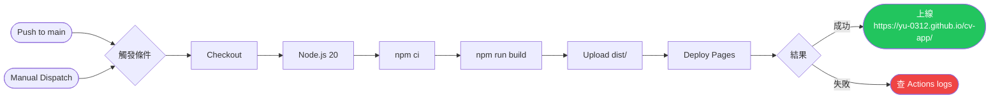

# CV Studio

> 一個整合履歷、學習歷程、求職顧問與學測落點分析的 PWA 工作台。

[English](README.en.md) · 正式站：<https://yu-0312.github.io/cv-app/>

---

## 功能

- **CV 履歷編輯器** — 28 種模板、即時預覽、WYSIWYG 直接編輯、多版本管理、PDF 匯出
- **Google 登入與雲端同步** — Supabase Auth + Google OAuth；RLS 保護個人資料
- **學習歷程 Portfolio** — 章節式作品集、素材庫、附件管理、PDF 匯出
- **公開分享頁 + SEO** — 動態 Open Graph metadata、1200×630 分享預覽圖
- **Career 求職顧問 + Career Ops** — 讀取 CV 摘要，支援單筆適配分析、批次職缺匯入評估、STAR 故事庫、薪資談判、客製 ATS PDF
- **學測落點分析** — 115 學年度校系資料、UAC 最低登記標準、University TW 快照
- **PWA 支援** — 可安裝為桌面或手機 App，Service Worker 離線快取

---

## 快速開始

### 需求

| 工具 | 用途 |
|------|------|
| Node.js 20+ | 建置環境 |
| Supabase 專案 | 資料庫與 OAuth |
| Google Cloud OAuth Client | Google 登入 |
| GitHub repository（選用） | GitHub Pages 部署 |

### 安裝

```bash
npm install
cp config.example.js config.js
```

編輯 `config.js`，填入 Supabase URL 與 anon key：

```js
window.CV_STUDIO_CONFIG = {
  supabaseUrl: "https://your-project.supabase.co",
  supabaseAnonKey: "your-anon-key",
  siteUrl: "https://your-username.github.io/your-repo/",
  defaultTemplate: "n-tech"
};
```

### 建置與測試

```bash
npm run build       # 輸出到 dist/
npm run smoke:test  # 建置 + headless Chrome smoke test
```

`npm run build` 輸出：`index.html`、`404.html`、`manifest.json`、`sw.js`、`config.js`、`data/app/*`、`.nojekyll`

---

## 部署到 GitHub Pages


```mermaid
flowchart LR
    A1([Push to main]) --> M{觸發條件}
    A2([Manual Dispatch]) --> M
    M --> B[Checkout] --> C[Node.js 20] --> D[npm ci] --> E[npm run build]
    E --> F[Upload dist/] --> G[Deploy Pages]
    G --> H{結果}
    H -->|成功| I([上線\nhttps://yu-0312.github.io/cv-app/])
    H -->|失敗| J([查 Actions logs])

    style I fill:#22c55e,color:#fff
    style J fill:#ef4444,color:#fff
```

本專案已內建 `.github/workflows/deploy.yml`。將 repository push 到 GitHub 後，到 **Settings > Pages** 把 Source 設為 **GitHub Actions**，之後每次 push to `main` 都會自動部署。

> 更換 Pages 網址後，請同步更新 `config.js` 的 `siteUrl`、Supabase 的 Site URL / Redirect URLs，以及 Google Cloud OAuth 的 origins / redirect URIs。

---

## 技術架構

| 層級 | 技術 |
|------|------|
| 前端 | Vanilla JS、單一 `index.html`（無框架） |
| 認證 | Supabase Auth + Google OAuth 2.0 |
| 資料庫 | Supabase PostgreSQL / JSONB + RLS |
| PDF | html2pdf.js |
| AI | BYOK — Anthropic、OpenAI、Gemini、Groq（key 只存 `sessionStorage`） |
| PWA | `manifest.json` + `sw.js` |
| 部署 | GitHub Actions + GitHub Pages |

---

## 專案結構

```text
CV App/
├── .github/
│   └── workflows/
│       ├── deploy.yml             # GitHub Pages 自動部署
│       ├── career-ops.yml         # 每日職缺快照
│       └── update-gsat-data.yml   # 每週學測資料更新
├── data/
│   ├── app/                       # 前端可載入的靜態資料快照
│   ├── normalized/                # 正規化原始資料
│   ├── raw/                       # 爬取的原始 JSON
│   └── sql/                       # Supabase seed SQL
├── scripts/
│   ├── lib/utils.mjs              # 共用工具（fetchWithRetry、ensureDir、CLI 解析）
│   ├── prepare-dist.mjs           # 建置腳本
│   ├── smoke-test.mjs             # headless Chrome smoke test
│   ├── career-ops-*.mjs           # Career Ops 後端管線
│   ├── import-104-gsat.mjs        # 104 學測資料匯入
│   ├── import-uac-scores.mjs      # UAC 最低標準匯入
│   ├── build-gsat-external-data.mjs
│   └── scrape-university-tw.mjs
├── index.html                     # 主應用程式
├── sw.js                          # Service Worker
├── manifest.json
├── config.js / config.example.js
├── supabase-schema.sql
└── supabase-university-tw-schema.sql
```

---

## 資料管線

### GSAT 學測資料

```bash
npm run gsat:104:standard      # 下載 104 五標
npm run gsat:104:major-list    # 抓取校系列表
npm run gsat:uac               # 抓取 UAC 最低登記標準
npm run gsat:build             # 整合產生 data/app/gsat-external-data.*
```

### University TW

```bash
npm run university-tw:scrape   # 爬取靜態資料
npm run university-tw:build    # 產生前端可載入的 app data
npm run university-tw:sql      # 產生 Supabase seed SQL
```

### Career Ops 後端管線

標準日常流程（GitHub Actions 每日執行）：

```bash
npm run career-ops:daily       # 等同 career-ops:parallel-pipeline --include-expired
```

完整手動流程（依資料依賴順序）：

```bash
# 1. 建立 / 擴張職缺來源
npm run career-ops:sources:build   # 依 source strategy 產生 sources
npm run career-ops:source-flex     # 規則擴張來源
npm run career-ops:search          # 匯入搜尋結果補充來源

# 2. 抓取與品質過濾
npm run career-ops:scrape          # 爬取職缺快照
npm run career-ops:quality         # 過濾低品質資料

# 3. 評分與洞察
npm run career-ops:evaluate        # heuristic 評分
npm run career-ops:intelligence    # 多維比對、市場洞察

# 4. 深度研究與投遞素材
npm run career-ops:deep-research   # 公司 / 職缺 dossier（可接 Brave/Bing/SerpAPI）
npm run career-ops:deep-fit        # 單職缺 fit dossier
npm run career-ops:compensation    # 薪資結構與談薪腳本
npm run career-ops:story-bank      # STAR+Reflection story bank
npm run career-ops:application-kit # 投遞 / outreach / 面試 playbook

# 或一次跑完（bounded concurrency）
npm run career-ops:parallel-pipeline -- --concurrency 6
```

職缺快照上傳到 Supabase Storage：

```bash
npm run career-ops:snapshot:shard
SUPABASE_URL="..." SUPABASE_SERVICE_ROLE_KEY="..." npm run career-ops:snapshot:publish
```

新加坡職缺（MyCareersFuture 公開 API）：

```bash
npm run career-ops:sg:scrape
```

---

## 常用指令

| 指令 | 用途 |
|------|------|
| `npm run build` | 建置靜態網站到 `dist/` |
| `npm run smoke:test` | 建置 + headless Chrome smoke test |
| `npm run career-ops:doctor` | 檢查環境、檔案、secret、Chrome path |
| `npm run career-ops:daily` | 完整日常管線（sources → scrape → evaluate → intelligence） |
| `npm run career-ops:parallel-pipeline` | 同上，可指定 `--concurrency` |
| `npm run career-ops:snapshot:publish` | 上傳職缺快照到 Supabase Storage |
| `npm run gsat:build` | 整合 104、UAC、University TW 產生學測資料 |

---

## Google 登入說明

本專案使用 Supabase Auth 取代已淘汰的 `gapi.auth2`：

1. 前端呼叫 `signInWithOAuth({ provider: "google" })`
2. 使用者前往 Google 完成登入
3. Supabase 帶回 session
4. 前端依 session 讀寫 `cv_profiles`（RLS 保護，使用者只能存取自己的資料）

Google OAuth 無法從 `file://` 運作，請使用 `http://localhost` 或正式 `https://` 測試登入。

---

## 上線檢查清單

- [ ] 正式站使用 `https://`，不是 `file://`
- [ ] Supabase Site URL / Redirect URLs 已包含正式網址
- [ ] Google Cloud OAuth origins / redirect URIs 已同步
- [ ] 實測登入、刷新、登出、再次刷新
- [ ] `npm run smoke:test` 通過
- [ ] GitHub Pages workflow 部署成功
- [ ] GitHub Secrets 已設定 `SUPABASE_URL` 與 `SUPABASE_SERVICE_ROLE_KEY`（Career Ops 快照上傳需要）
